<script type="text/javascript">
	<!--
	var timer;
	var rate = 200;			// レート (msec)
	var frameNum = 71;
	
	function startMovie(){
		document.location.replace("#start");
		callback(1);
	}
	
	function callback(num){
	  if (window.innerWidth < 420) {
	    window.scrollBy(0, 190);
	  } else {
	    window.scrollBy(0, 250);
	  }
		
		if (num < frameNum){
			num++;
			timer = setTimeout("callback(" + num + ")", rate);
		}
	}
	-->
</script>

<style type="text/css">
body {
  -webkit-text-size-adjust: 100%;
}

#film  {
	background: url(./cutoffAnime/film.gif) repeat-y center top;
}

@media (max-width: 420px) {
  #film .frame img { width: 240px; height: 180px }
  #film {
	  background: url(./cutoffAnime/film_s.gif) repeat-y center top;
  }
}

.content_box {
  text-align: center;
}

</style>

```{r setup, include=FALSE}
knitr::opts_chunk$set(echo = TRUE, prompt=TRUE, comment="#")
#setwd("..")
```

----

[トップへ戻る](index.html)

----

ちょろいJavaScriptで動かす、ぱらぱらマンガ。 

<div class="index" id="top">
<span class="marker">・</span>
<span class="title">
<a href="javascript:startMovie()">再生</a>
</span>
</div>


<div id="film" class="content_box">

<div id="start">

</div>

<div class="frame">
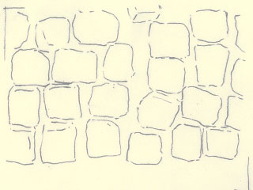
</div>
<div class="frame">

</div>
<div class="frame">

</div>
<div class="frame">
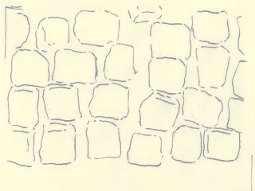
</div>
<div class="frame">
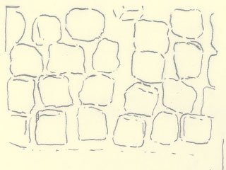
</div>
<div class="frame">
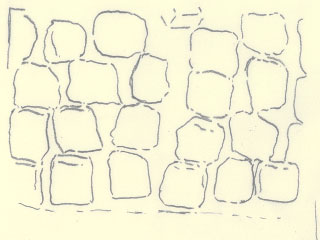
</div>
<div class="frame">
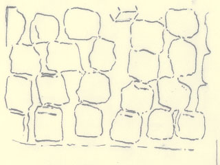
</div>
<div class="frame">
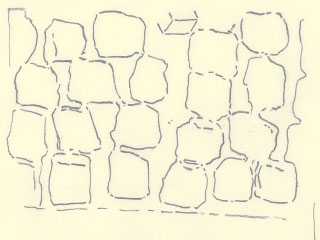
</div>
<div class="frame">
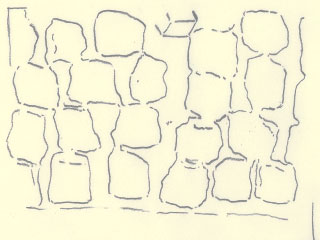
</div>
<div class="frame">
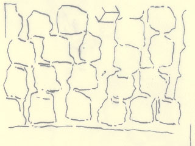
</div>
<div class="frame">
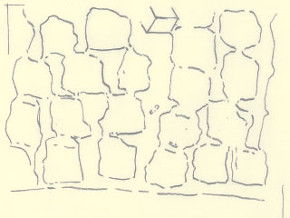
</div>
<div class="frame">
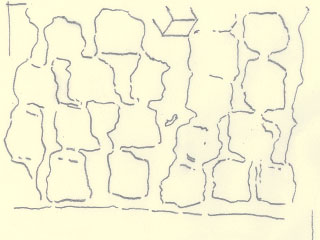
</div>
<div class="frame">
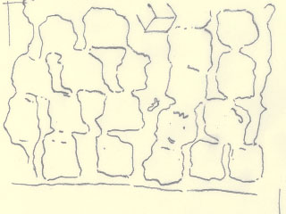
</div>
<div class="frame">
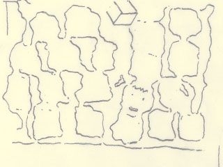
</div>
<div class="frame">
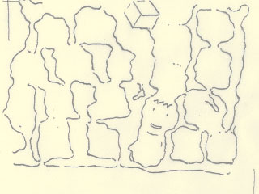
</div>
<div class="frame">
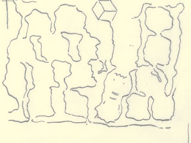
</div>
<div class="frame">
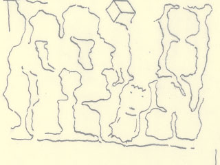
</div>
<div class="frame">
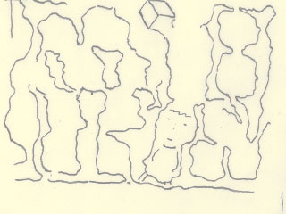
</div>
<div class="frame">
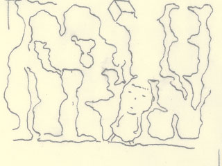
</div>
<div class="frame">
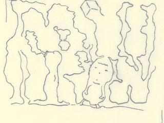
</div>
<div class="frame">
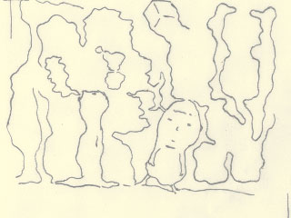
</div>
<div class="frame">

</div>
<div class="frame">

</div>
<div class="frame">

</div>
<div class="frame">
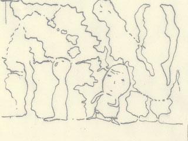
</div>
<div class="frame">
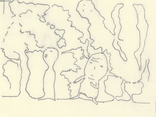
</div>
<div class="frame">
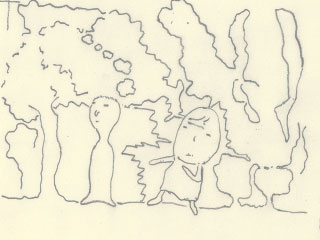
</div>
<div class="frame">
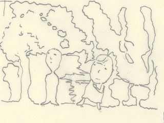
</div>
<div class="frame">
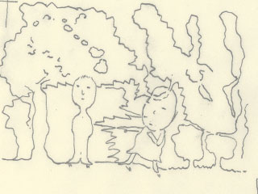
</div>
<div class="frame">
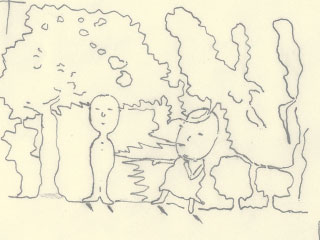
</div>
<div class="frame">
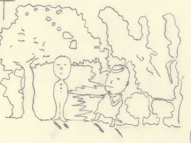
</div>
<div class="frame">

</div>
<div class="frame">
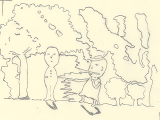
</div>
<div class="frame">
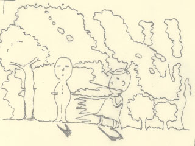
</div>
<div class="frame">

</div>
<div class="frame">
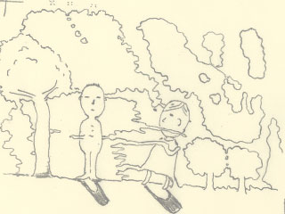
</div>
<div class="frame">
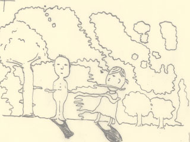
</div>
<div class="frame">
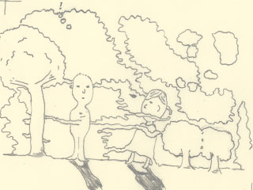
</div>
<div class="frame">
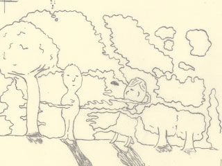
</div>
<div class="frame">
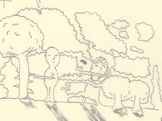
</div>
<div class="frame">

</div>
<div class="frame">
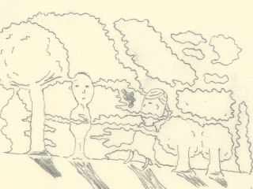
</div>
<div class="frame">

</div>
<div class="frame">
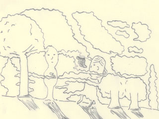
</div>
<div class="frame">
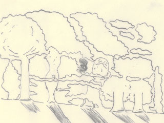
</div>
<div class="frame">
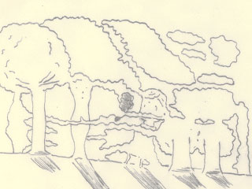
</div>
<div class="frame">
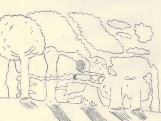
</div>
<div class="frame">
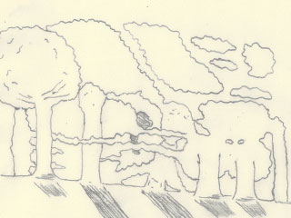
</div>
<div class="frame">
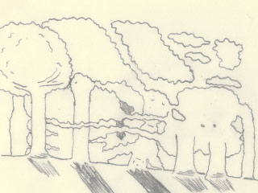
</div>
<div class="frame">

</div>
<div class="frame">
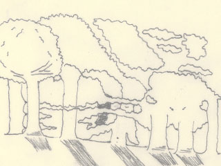
</div>
<div class="frame">
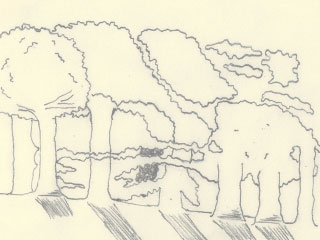
</div>
<div class="frame">

</div>
<div class="frame">
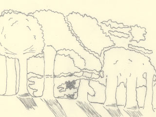
</div>
<div class="frame">
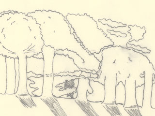
</div>
<div class="frame">
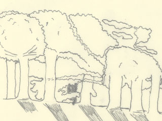
</div>
<div class="frame">
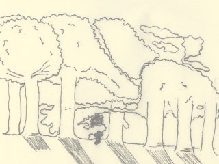
</div>
<div class="frame">

</div>
<div class="frame">
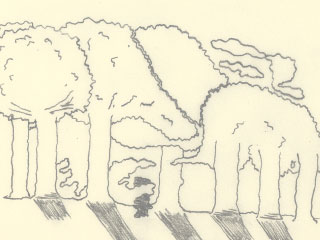
</div>
<div class="frame">

</div>
<div class="frame">
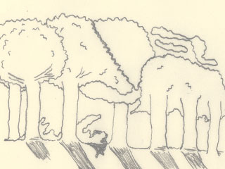
</div>
<div class="frame">
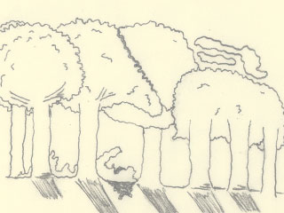
</div>
<div class="frame">
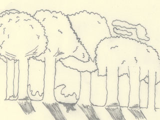
</div>
<div class="frame">

</div>
<div class="frame">

</div>
<div class="frame">

</div>
<div class="frame">

</div>
<div class="frame">

</div>
<div class="frame">

</div>
<div class="frame">

</div>
<div class="frame">

</div>
</div>

----

<div id="to_top">
<a href="#top"><span class="mark">▲</span>&nbsp;上に戻る</a>
</div>